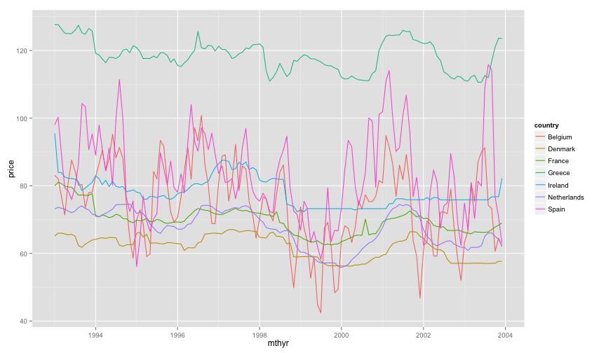
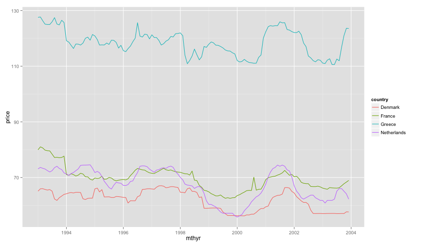
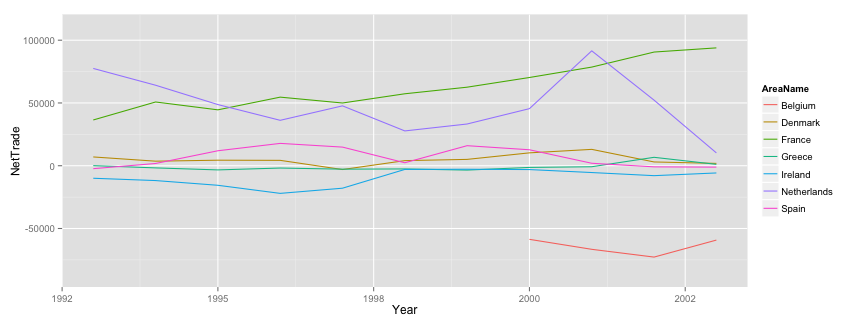
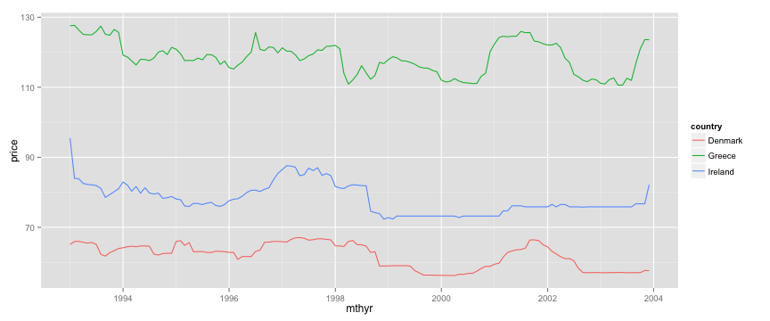

## Now what?

So the story begins with us making the following observations in our data:
1. France, Denmark, Netherlands and Greece have cointegrated price series.
2. Belgium, Spain and Ireland doesn't have I(1) behaviours and do not appear to have particular long-run relationships with the cointegrated countries
3. Greece seem to have an exceptional price gap with the other cointegrated countries
4. Ireland have extraordinarily stable prices compared to Belgium and Spain amongst the non-I(1) countries
5. Belgium and Spain seem to have exceptionally volatile price series

---

## Looking at all countries

 

---

## France, Greece, Denmark, Netherlands

Greece appears to have extraordinarily high prices

 

---

## Belgium, Spain & Ireland

Belgium & Spain have volatile prices while Ireland have exceptionally stable prices

 

---

## Some Background & Theory

Some major theme surrounding the Law of One Price:

1. Transport/Transaction Costs

2. Market Integration

3. Market Structure

Clearly, the above factors would directly impact whether the LOOP works; but when it doesn't actually work, what do we observe? We can't always be sure.

---

## Not this Price....

The intuition is that when there is transport/transaction costs, then the price series observed should differ by exactly those costs; yet there are implicit assumptions unaddressed:

1. Does both markets have producers or only one?
2. Are the production costs the same in both markets?

---

## ... then any Price below it

In the cases where production costs is different then the lower cost producer can export, but if the transport costs raises selling price above the costs of the other producer, then the other producer can still stay in business. So the implications is such:

1. The market with higher-cost production will have a price higher than the market with lower-cost production but the gap might be smaller than the transport/transaction costs by virtue of competition between the domestic producers in the higher-cost markets
2. We should also observe that in this case, the price series not only do not converge, they would not even cointegrate since the prices would be more sensitive to local demand and supply as long as the price movements falls within the price-ceiling created by the presence of the lower-cost producer (adjusting for transport/transaction costs)

---

## Who provides the lower bound prices?

From the net export figures in quantity of live chickens, it appears that France and Netherlands are the export powerhouse though Denmark appears to have much price advantage.

 

Since trade figures were annual, it was much harder to get a sense of how it relates to local demand-supply shocks in Spain and Belgium. Data was also sparse for Belgium

---

## Suppose France & Netherlands were the core producers

We include Greece as a sort of 'upper bound' in terms of prices, the 'maximum' transaction costs involved. Denmark serves as a 'lower bound' in prices but since it hardly exported, it wasn't exactly an important threat to the domestic producers in Spain & Belgium

 

1. Belgium and Spain indeed have more volatile price series, and when their prices falls below France/Netherlands' prices, it doesn't stay for that long.
2. Belgium and Spain clearly have prices fluctuating within a certain band that is between Denmark and Greece selling prices

---

## How about Greece (& Ireland)?

So far so good, we assume competitive producers in Belgium and Spain with higher production costs but able to sell locally at prices below the foreign price + transaction costs. But why is Greece prices cointegrated but so high? And we see the same trend for Ireland as well though it is not cointegrated with the other 4 countries statistically.

1. Greece (& Ireland) domestic producers may have significant market power which allows them to price at levels just below the foreign price + transaction costs.
2. Explains why their selling prices are cointegrated: they price close to the ceiling and thus their selling prices are sensitive to the ceiling and mirrors price movement patterns.
3. Pricing power also partly explains the lack of volatility in Ireland's prices.

---

## Market Power

We can see and imagine some sort of price ceiling for Greece and Ireland that fluctuates with Denmark's prices

 

Greek chicken farms were indeed caught and fined for price-fixing through 1996-2010, reflecting the market power present in the suppliers of live chickens in Greece. 

---

## Summary

Summarizing our findings with this simple theory of price-ceiling suggests the following:

1. Countries with cointegrated prices generally suggests market integration, implying low market barriers in transport/transaction costs.
2. Cointegrated prices with significant price gaps implies significant transport/natural-barriers combined with local market power.
3. Non-cointegrated prices suggests the presence of locally competitive markets with significant transport/natural-barriers - further evidence from significantly higher volatility than the 'regional price'.

